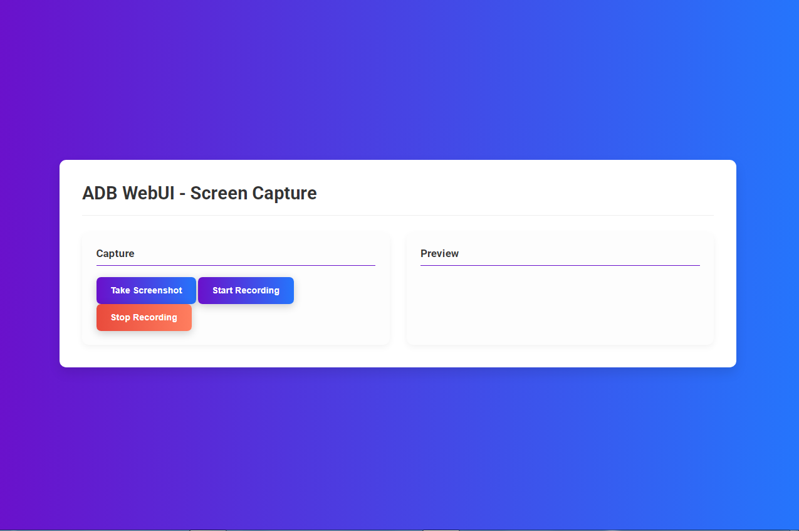

# ADB WebUI

A simple, intuitive web-based interface for managing Android devices with the Android Debug Bridge (ADB).


## Features

*   **Web-Based UI:** Control your Android device from your web browser.
*   **File Manager:** Browse, view, and delete files on your device.
*   **App Management:** List and uninstall installed applications.
*   **Screen Capture:** Take screenshots and record the screen of your device.
*   **Live Screen Sharing:** View your device's screen in real-time in your browser.
*   **Shell Execute:** Run any ADB shell command directly from the UI.

## Screenshots

| File Manager | App Management | Screen Capture |
| :---: | :---: | :---: |
|  |  |  |

## Installation

1.  **Prerequisites:**
    *   Python 3.6+
    *   ADB (Android Debug Bridge) installed and in your system's PATH.

2.  **Clone the repository:**

    ```bash
    git clone https://github.com/catebyte/ADB-Advanced-WEB-UI-Tool-.git
    cd ADB-Advanced-WEB-UI-Tool-
    ```

3.  **Install the dependencies:**

    ```bash
    pip install -r requirements.txt
    ```

## Usage

1.  **Run the application:**

    ```bash
    python app.py
    ```

2.  **Open your web browser** and navigate to `http://127.0.0.1:5000`.

3.  **Login** with the default credentials:
    *   **Username:** `admin`
    *   **Password:** `admin`

4.  **Connect to your device:**
    *   Enable ADB debugging on your Android device.
    *   Connect your device to your computer via USB or Wi-Fi.
    *   Enter your device's IP address in the WebUI and click "Connect".

## ⚠️ Warnings & Disclaimers

> ⚠️ **Use at Your Own Risk**  
> This tool gives full control over Android devices via ADB. Misuse can result in data loss, bricked devices, or permanent damage. Always test carefully.

> 🔐 **For Trusted Devices Only**  
> Use only with devices you own or have permission to control. Unauthorized use may violate laws or terms of service.

> ❌ **No Warranty or Liability**  
> This software is provided "as is" without warranty. The developers are not responsible for any harm, data loss, or legal issues arising from its use.

> 🛑 **Highly Privileged Features**  
> This interface allows direct file access, app control, screen mirroring, and shell command execution. Do not run on shared or insecure systems.

> 🌐 **Secure Your Deployment**  
> If hosted on a network or public server:
> - Always enable authentication
> - Use HTTPS (SSL)
> - Restrict access by IP or VPN  
> Never expose the interface to the open internet without protection.

## How to Contribute

Contributions are welcome! If you have any ideas, suggestions, or bug reports, please open an issue or submit a pull request.

## License

This project is licensed under the MIT License. See the `LICENSE` file for details.
